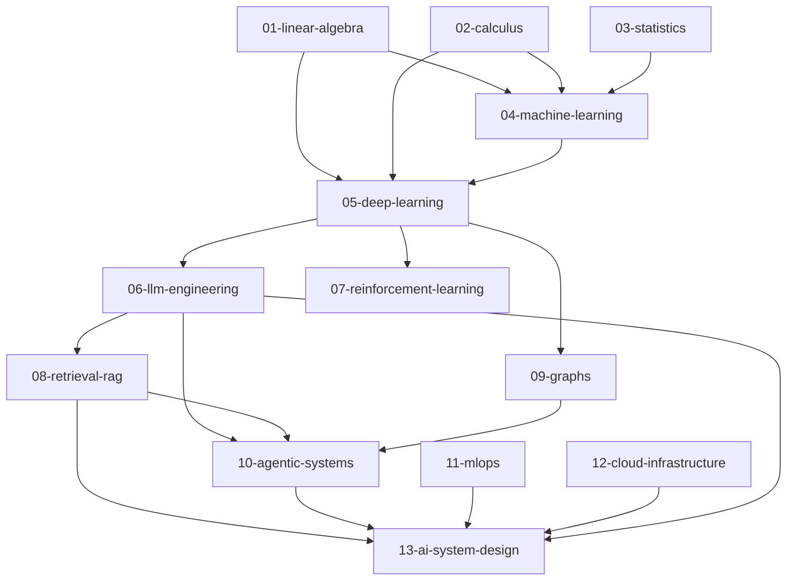

# Curriculum Roadmap

This repository progresses from mathematical foundations (linear algebra, calculus, statistics) through core ML/DL, then into modern AI systems (LLMs, RAG, agents, RL, graphs), production engineering (MLOps, cloud infrastructure), and culminates in a capstone system-design module — mirroring the arc that separates a senior ML practitioner from a principal AI engineer. Every section is built for principal/lead AI Engineering interview prep, with implementations written from scratch in PyTorch so that conceptual depth is proven by working code, not just recalled definitions.

---

## Prerequisite Graph

---

## Milestone Phases

- **Phase 1 — Foundations (01–03):** Done when you can derive the chain rule, perform eigendecomposition by hand, and explain the bias-variance tradeoff with statistical rigor.
- **Phase 2 — Core ML/DL (04–05):** Done when you have implemented a full training loop — including backpropagation and a custom optimizer — from scratch in PyTorch with passing tests.
- **Phase 3 — Modern AI (06–10):** Done when you have built a working RAG pipeline, fine-tuned a transformer, and implemented a basic multi-tool agent loop, all backed by interview-bank answers.
- **Phase 4 — Production (11–12):** Done when you can articulate and demo a model deployment pipeline with monitoring, rollback, and cloud-cost tradeoffs.
- **Phase 5 — Capstone (13):** Done when you can design a complete, scalable AI system under interview conditions — covering data, training, serving, reliability, and cost — and defend every architectural choice.

---

## Interview-Readiness Track

Work through the `interview.md` file in each section directory and check off each item below as you can answer confidently without notes.

- [ ] Complete all `interview.md` Q&A banks for Phase 1 sections (`01-linear-algebra`, `02-calculus`, `03-statistics`).
- [ ] Complete all `interview.md` Q&A banks for Phase 2 sections (`04-machine-learning`, `05-deep-learning`) and verify you can whiteboard backprop end-to-end.
- [ ] Complete `06-llm-engineering/interview.md` — cover attention, tokenization, fine-tuning strategies, and RLHF tradeoffs.
- [ ] Complete `08-retrieval-rag/interview.md` and `10-agentic-systems/interview.md` — be able to design a production RAG system and explain agent memory/tool-use patterns.
- [ ] Complete `07-reinforcement-learning/interview.md` and `09-graphs/interview.md` to round out model-type breadth.
- [ ] Complete `11-mlops/interview.md` and `12-cloud-infrastructure/interview.md` — cover CI/CD for models, feature stores, serving infra, and cost optimization.
- [ ] Conduct a timed mock system-design session using `13-ai-system-design` prompts, covering a full design from data ingestion to serving with reliability and cost analysis.
- [ ] Pass a full-length mock interview (90 min) that samples questions from at least five sections — treat any answer requiring notes as a gap to close before scheduling real interviews.

---

For current completion status across all sections, see [PROGRESS.md](./PROGRESS.md).
